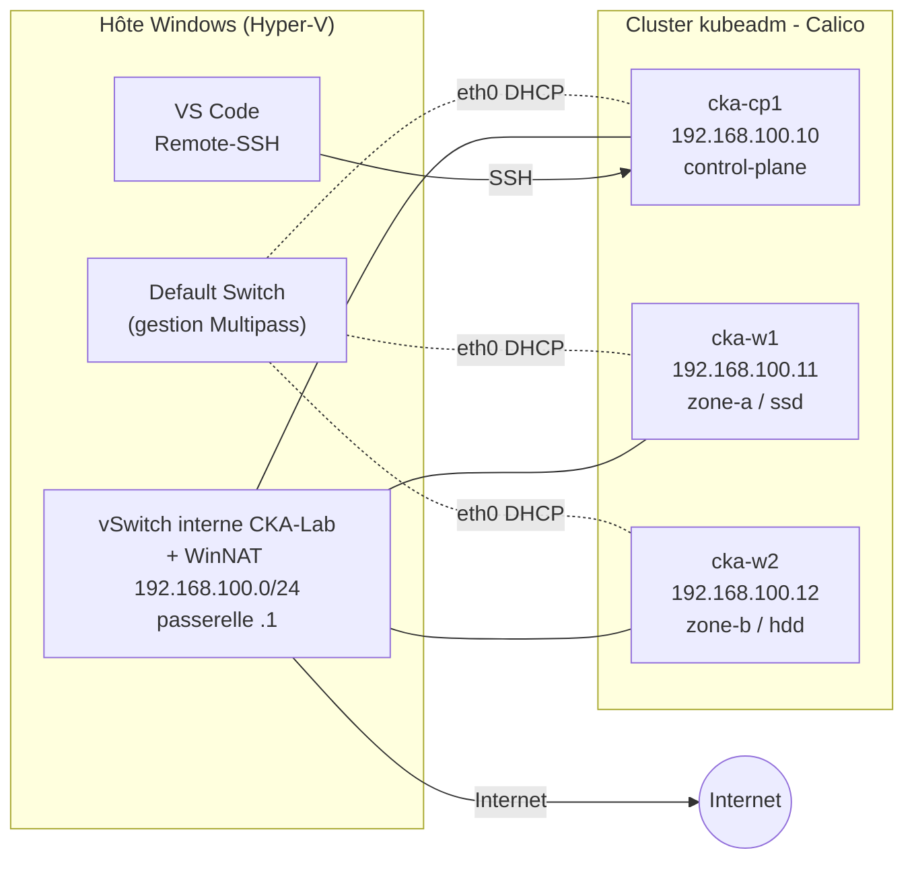

# Prepa-CKA

Lab local et reproductible pour préparer la certification **CKA (Certified Kubernetes Administrator)** : un cluster `kubeadm` de 3 nœuds sur **Hyper-V + Multipass**, avec IP fixes, persistant au redémarrage de l'hôte, piloté depuis **VS Code**, et peuplé d'une charge réaliste alignée sur le programme de l'examen.

> Objectif : s'entraîner dans des conditions proches de l'examen (kubeadm, Ubuntu, SSH vers les nœuds, `kubectl`/`vim` en terminal), pouvoir tout casser, et revenir à un état propre en une commande.

---

## Sommaire

- [Architecture](#architecture)
- [Prérequis](#prérequis)
- [Démarrage rapide](#démarrage-rapide)
- [Utilisation au quotidien](#utilisation-au-quotidien)
- [Référence du script `cka-lab.ps1`](#référence-du-script-cka-labps1)
- [Charge réaliste : `cka-seed.sh`](#charge-réaliste--cka-seedsh)
- [Organisation des fichiers](#organisation-des-fichiers)
- [Sécurité](#sécurité)
- [Dépannage](#dépannage)
- [Limites connues](#limites-connues)

---

## Architecture



| Nœud | IP fixe | vCPU | RAM | Disque | Rôle |
|---|---|---|---|---|---|
| `cka-cp1` | 192.168.100.10 | 2 | 4 Go | 30 Go | control-plane |
| `cka-w1` | 192.168.100.11 | 2 | 3 Go | 25 Go | worker |
| `cka-w2` | 192.168.100.12 | 2 | 3 Go | 25 Go | worker |

**Choix techniques**

- **Deux interfaces par nœud.** Multipass garde toujours une interface sur le *Default Switch* Hyper-V, dont le sous-réseau change à chaque redémarrage. Kubernetes est donc volontairement lié à une seconde interface, sur un vSwitch interne + NAT dédié, avec IP fixes (`--node-ip`, `--apiserver-advertise-address`, autodétection Calico par CIDR).
- **Version décalée.** Le cluster est installé en **v1.34** alors que l'examen porte sur la **v1.35**, pour pouvoir s'entraîner à l'upgrade `kubeadm` (paramètre `-K8sMinor`).
- **Persistance.** Les VM démarrent automatiquement avec l'hôte, et une tâche planifiée vérifie le vSwitch, le NAT et l'état des VM à chaque démarrage.

---

## Prérequis

| Élément | Détail |
|---|---|
| OS | Windows 10/11 **Pro ou Entreprise** (Hyper-V indisponible sur l'édition Famille) |
| Hyper-V | `Enable-WindowsOptionalFeature -Online -FeatureName Microsoft-Hyper-V -All` puis redémarrage |
| Multipass | `winget install Canonical.Multipass`, puis `multipass set local.driver=hyperv` |
| Git | `winget install --id Git.Git -e` |
| VS Code | avec l'extension `ms-vscode-remote.remote-ssh` |
| Client OpenSSH | présent par défaut sur Windows 10/11 |
| Ressources | 16 Go de RAM minimum (le lab en consomme environ 10), ~90 Go libres sur le disque cible |

---

## Démarrage rapide

**1. Cloner le dépôt** (PowerShell **non admin**, le dossier cible doit être vide ou inexistant) :

```powershell
git clone https://github.com/<ton-compte>/Prepa-CKA.git D:\cka
cd D:\cka
git config core.hooksPath .githooks
```

**2. Créer le lab** (PowerShell **admin**, 20 à 30 minutes) :

```powershell
Set-ExecutionPolicy -Scope Process Bypass
.\cka-lab.ps1 -Action Create
```

**3. Peupler le cluster** puis figer l'état de référence :

```powershell
scp D:\cka\cka-seed.sh cka-cp1:
ssh cka-cp1 bash cka-seed.sh
.\cka-lab.ps1 -Action Snapshot -SnapshotName seeded
```

**4. Vérifier :**

```powershell
ssh cka-cp1 kubectl get nodes -o wide
```

La colonne `INTERNAL-IP` doit afficher des adresses en `192.168.100.x`.

---

## Utilisation au quotidien

**Accès au cluster**

| Méthode | Commande | Usage |
|---|---|---|
| SSH (conditions d'examen) | `ssh cka-cp1`, puis `sudo -i` si besoin | entraînement principal |
| VS Code | F1 → *Remote-SSH: Connect to Host* → `cka-cp1` | relecture, agents |
| kubectl depuis Windows | ouvrir `D:\cka` dans VS Code (le `KUBECONFIG` est préconfiguré dans le terminal intégré) | outillage |
| Secours | `multipass shell cka-cp1` | si SSH ou le réseau du lab sont cassés |

**Déjà configuré sur les nœuds :** alias `k` et autocomplétion bash, `vim`, `jq`, `crictl`, `etcdctl` (si le paquet est disponible). **Sur `cka-cp1` :** `kubectl` et `helm`.

**Volontairement non configuré :** les raccourcis personnels (`$do`, `$now`, `.vimrc`). Ils sont à retaper au début de chaque session, comme le jour de l'examen :

```bash
export do="--dry-run=client -o yaml"
export now="--force --grace-period=0"
echo 'set tabstop=2 shiftwidth=2 expandtab' >> ~/.vimrc
```

**Cycle d'entraînement recommandé**

```powershell
.\cka-lab.ps1 -Action Restore -SnapshotName seeded             # repartir d'un état propre
.\cka-lab.ps1 -Action Snapshot -SnapshotName avant-upgrade     # avant un exercice risqué
```

---

## Référence du script `cka-lab.ps1`

**Actions**

| Action | Effet |
|---|---|
| `Create` | crée le réseau, les VM et le cluster, configure l'accès depuis l'hôte, prend le snapshot `clean` (idempotent) |
| `Status` | état des VM, du NAT et des nœuds Kubernetes |
| `Snapshot` | arrête le lab, prend un snapshot des 3 nœuds, redémarre |
| `Restore` | restaure un snapshot sur les 3 nœuds |
| `Repair` | vérifie le vSwitch et le NAT, démarre les VM arrêtées (appelée au démarrage par la tâche planifiée) |
| `Destroy` | supprime le lab (VM, réseau, tâche, entrées hosts et SSH) ; conserve le script, la clé SSH et le stockage Multipass |
| `ResetStorage` | ramène le stockage Multipass à son emplacement par défaut (aucune instance ne doit exister) |

**Paramètres**

| Paramètre | Défaut | Rôle |
|---|---|---|
| `-K8sMinor` | `1.34` | version mineure de Kubernetes installée |
| `-CalicoVersion` | `v3.31.4` | version de Calico |
| `-UbuntuImage` | `24.04` | image Ubuntu utilisée par Multipass |
| `-SwitchName` | `CKA-Lab` | nom du vSwitch Hyper-V |
| `-NetPrefix` | `192.168.100` | préfixe du réseau du lab (/24) |
| `-PodCidr` | `10.244.0.0/16` | réseau des pods |
| `-LabRoot` | `D:\cka` | dossier des fichiers du lab |
| `-MultipassStorage` | `D:\multipass` | stockage Multipass, **commun à toutes les instances Multipass de l'hôte** |
| `-SnapshotName` | `clean` | nom du snapshot pour `Snapshot` et `Restore` |
| `-NoSnapshot` | — | ne pas prendre le snapshot `clean` à la fin de `Create` |

> Si tu changes `-LabRoot`, `-NetPrefix` ou `-SwitchName`, passe la même valeur à **toutes** les actions suivantes.

---

## Charge réaliste : `cka-seed.sh`

Script idempotent, exécuté sur `cka-cp1`, qui transforme le cluster vierge en environnement proche de ceux de l'examen. Il n'introduit **aucune panne** : la casse relève d'un outil séparé.

**Composants additionnels**

| Composant | Version | Usage |
|---|---|---|
| local-path-provisioner | v0.0.37 | StorageClass `local-path` par défaut |
| metrics-server | v0.9.0 | `kubectl top`, HPA |
| Gateway API (canal standard) | v1.6.1 | CRDs Gateway, HTTPRoute, ReferenceGrant… |
| Traefik (chart Helm) | 41.6.0 | IngressClass `traefik` + GatewayClass/Gateway, NodePort 30080/30443 |
| podinfo (chart Helm) | 6.15.0 | service `api` |

**Contenu par namespace**

| Namespace | Contenu | Thèmes CKA |
|---|---|---|
| `frontend` | nginx ×3, ConfigMap, probes, HPA, PDB, répartition sur les zones, Ingress, HTTPRoute | workloads, réseau, Gateway API |
| `backend` | api (Helm), redis, worker avec init container et PriorityClass, ReferenceGrant | Helm, configuration, accès entre namespaces |
| `data` | PostgreSQL en StatefulSet avec PVC dynamique, NetworkPolicies, ressources personnalisées `Backup` | stockage, NetworkPolicy, CRD |
| `monitoring` | DaemonSet sur tous les nœuds (toleration, hostPath), ClusterRole | scheduling, RBAC |
| `batch` | CronJob, Job | workloads |
| `team-a` | ResourceQuota, LimitRange, RBAC (utilisateur, ServiceAccount), sidecar, PV statique | quotas, RBAC, stockage manuel |

Les manifests appliqués sont conservés dans `~/manifests/seed` sur `cka-cp1`, et un exemple Kustomize (non appliqué) dans `~/manifests/kustomize`.

**Tests rapides**

```bash
curl -H 'Host: shop.local'        http://192.168.100.11:30080/      # Gateway API -> frontend
curl -H 'Host: shop.local'        http://192.168.100.11:30080/api   # Gateway API -> backend (ReferenceGrant)
curl -H 'Host: legacy.shop.local' http://192.168.100.11:30080/      # Ingress -> frontend
kubectl top nodes
kubectl get bk -A
```

---

## Organisation des fichiers

```
D:\cka\                         <- dépôt Git
├── cka-lab.ps1                 provisioning du lab (versionné)
├── cka-seed.sh                 charge réaliste (versionné)
├── README.md
├── .gitignore / .gitattributes
├── .githooks\pre-commit        blocage local des secrets (versionné)
├── .vscode\settings.json       KUBECONFIG du terminal intégré (versionné)
├── cloud-init\                 généré - ignoré par Git
├── ssh\                        clé privée, config, known_hosts - ignoré, accès restreint
├── kube\config                 kubeconfig cluster-admin - ignoré, accès restreint
└── logs\repair.log             journal de la tâche de démarrage - ignoré

D:\multipass\                   stockage Multipass (hors dépôt)
```

Modifications faites **hors** de `D:\cka` : un bloc dans le fichier `hosts` de Windows, une ligne `Include` en tête de `~/.ssh/config`, le vSwitch et le NAT Hyper-V, la tâche planifiée `CKA-Lab-Repair`, et la variable système `MULTIPASS_STORAGE`.

---

## Sécurité

- **Aucun secret n'est versionné.** La clé SSH, le kubeconfig et les cloud-init sont générés localement par `Create` et exclus par `.gitignore`. Un nouveau PC produit ses propres secrets.
- **Hook `pre-commit`** : il bloque l'ajout de fichiers sensibles (`ssh/`, `kube/`, clés, `.pem`…) et de contenus de type clé privée ou certificat kubeconfig. Il s'active avec `git config core.hooksPath .githooks`, à refaire après chaque clone.
- **Dépôt privé** : la protection de GitHub contre l'envoi de secrets ne couvre automatiquement que les dépôts publics. Le `.gitignore` et le hook sont donc la protection principale.
- **Droits NTFS** : `ssh\` et `kube\` sont restreints à l'utilisateur courant, SYSTEM et Administrateurs (condition exigée par OpenSSH pour Windows).
- **Portée du lab** : `metrics-server` est configuré avec `--kubelet-insecure-tls` et les Secrets du seed contiennent des valeurs fictives. C'est acceptable pour un lab isolé, pas pour un environnement réel.
- **En cas de fuite** : invalide d'abord le secret (supprimer `ssh\cka_lab_ed25519*`, ou `Destroy` puis `Create` pour régénérer les certificats), puis nettoie l'historique Git. Supprimer le fichier dans un nouveau commit ne suffit pas.

---

## Dépannage

| Symptôme | Cause | Solution |
|---|---|---|
| `New-NetNat … Windows System Error 52` | un autre NAT, parfois invisible, utilise déjà le préfixe | `Get-NetNat` ; supprimer le NAT en conflit, redémarrer Windows, ou relancer avec `-NetPrefix 192.168.150` |
| `NAT '…' (hors lab CKA) couvre deja …` | un NAT d'un autre environnement utilise le même réseau | le supprimer s'il ne sert plus, sinon changer `-NetPrefix` |
| `cannot connect to the multipass socket` | service Multipass arrêté | `Start-Service Multipass` (le script le fait automatiquement) |
| `Hash of … does not match` au lancement | image en cache corrompue | arrêter le service, supprimer `…\cache\vault\images\noble-*`, `multipass find --force-update` |
| `detected dubious ownership` (Git) | fichiers créés par une session admin | `git config --global --add safe.directory D:/cka` |
| Script bash en échec après transfert (`mkdi: command not found`, `\r`) | fins de ligne Windows, ou guillemets retirés par PowerShell 5.1 | lancer `ssh cka-cp1 bash cka-seed.sh` sans guillemets imbriqués ; `.gitattributes` force LF sur `*.sh` |
| `INTERNAL-IP` d'un nœud hors `192.168.100.x` | le nœud a pris l'IP de l'interface du Default Switch | vérifier `/etc/default/kubelet` (`--node-ip`) sur le nœud |
| `ImagePullBackOff` avec `toomanyrequests` | limite de téléchargement de Docker Hub sans authentification | attendre puis relancer le seed |

Journal de la tâche de démarrage : `D:\cka\logs\repair.log`.

---

## Limites connues

- Hyper-V n'autorise en pratique qu'un NAT par réseau : un second lab ayant besoin d'IP fixes devrait réutiliser le vSwitch `CKA-Lab`.
- Le stockage Multipass est global à l'hôte : il n'est déplacé que si aucune instance Multipass n'existe.
- La tâche planifiée exécute le script présent dans le dossier du dépôt, donc celui de la **branche courante** : revenir sur `main` avant d'éteindre la machine.
- Le contenu exact des clusters d'examen n'est pas public : le seed reflète le programme officiel et les retours de candidats, pas une copie de l'examen.

---

## Références

- [Programme officiel CKA - Linux Foundation](https://training.linuxfoundation.org/certification/certified-kubernetes-administrator-cka/)
- [Installation de kubeadm](https://kubernetes.io/docs/setup/production-environment/tools/kubeadm/install-kubeadm/)
- [Multipass : IP statiques](https://documentation.ubuntu.com/multipass/latest/how-to-guides/manage-instances/configure-static-ips/)
- [Multipass : emplacement du stockage](https://documentation.ubuntu.com/multipass/latest/how-to-guides/customise-multipass/configure-where-multipass-stores-external-data/)
- [Hyper-V : réseau NAT](https://learn.microsoft.com/windows-server/virtualization/hyper-v/setup-nat-network)
- [Calico : installation avec l'opérateur](https://docs.tigera.io/calico/latest/getting-started/kubernetes/)
- [Gateway API](https://gateway-api.sigs.k8s.io/)
